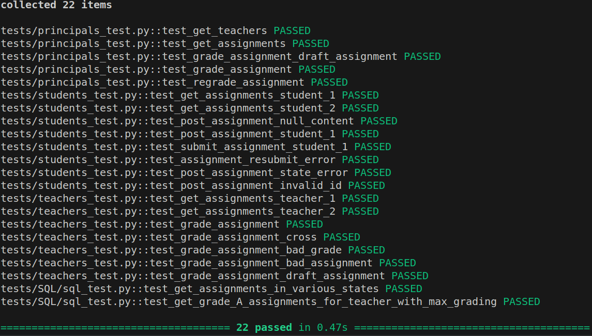
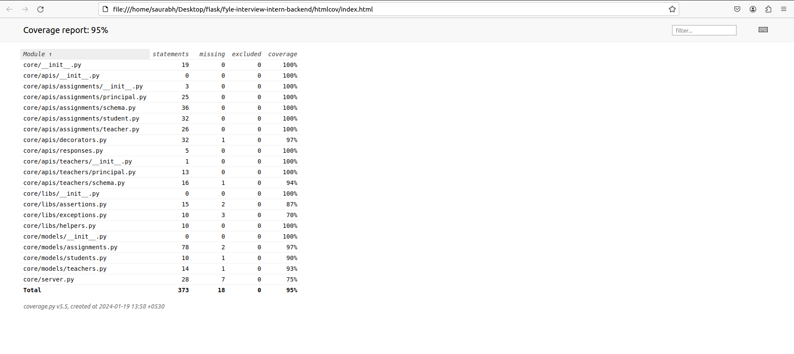
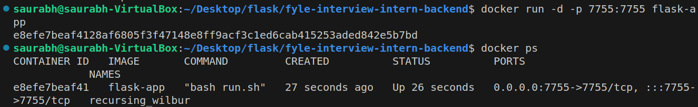

# Fyle Backend Challenge

## Who is this for?

This challenge is meant for candidates who wish to intern at Fyle and work with our engineering team. You should be able to commit to at least 6 months of dedicated time for internship.

## Challenge outline

This challenge involves writing a backend service for a classroom. The challenge is described in detail [here](./Application.md)

## Coverage Report





## Installation

1. Fork this repository to your github account
2. Clone the forked repository and proceed with steps mentioned below

### Install requirements

```
virtualenv env --python=python3.8
source env/bin/activate
pip install -r requirements.txt
```
### Reset DB

```
export FLASK_APP=core/server.py
rm core/store.sqlite3
flask db upgrade -d core/migrations/
```
### Start Server

```
bash run.sh
```
### Run Tests

```
pytest -vvv -s tests/

# for test coverage report
# pytest --cov
# open htmlcov/index.html
```

## Building docker image

```
docker build --tag flask-app .
```
To check images present :-
```
docker images 
```

## Runing app through docker 

```
docker run -d -p 7755:7755 flask-app
```

## Running app through docker-compose

```
docker compose up
```

## Sample Docker run image


